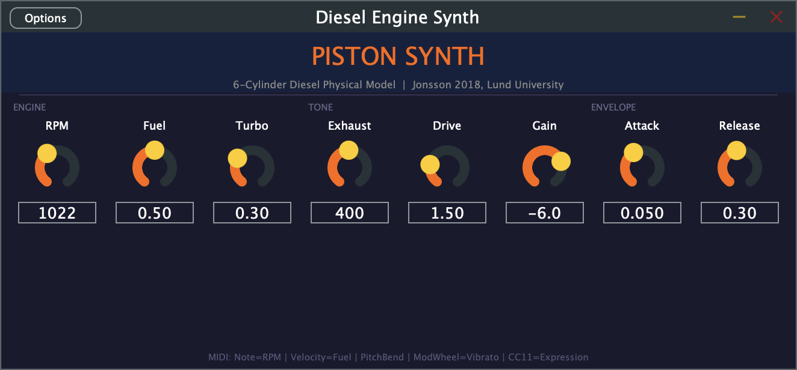

# Piston Synth



A physical-modeling synthesizer that turns the thermodynamics of a 6-cylinder diesel engine into a musical instrument. Every sound — melodic voices, kick drums, snares, hi-hats, cymbals — is generated from the same combustion physics.

## Based On

**"Physical modeling of a heavy-duty engine for test-cycle simulations in Modelica"**
Peter Jonsson, MSc Thesis TFRT-6054, Lund University, Department of Automatic Control, 2018.
[Full text (PDF)](https://lup.lub.lu.se/luur/download?func=downloadFile&recordOId=8953719&fileOId=8953720)

The thesis models a 6-cylinder compression-ignition diesel engine using physical equations for cylinder volume, adiabatic compression, combustion timing, ignition delay, friction, exhaust temperature, and turbocharger mass flow. This project maps those equations directly to audio synthesis.

## How It Works

### Physics → Audio

| Thesis Equation | Audio Use |
|----------------|-----------|
| **Eq 3.2** — Cylinder volume V(θ) with connecting rod geometry | Waveform shape — the `sqrt(R²-sin²θ)` term creates inharmonic overtones |
| **Eq 3.3** — Adiabatic compression pVᵞ = C | Pressure rise during compression stroke |
| **Eq 3.4–3.5** — Combustion pressure and temperature | Peak pressure spike at TDC, scaled by fuel injection |
| **Eq 3.6–3.7** — Arrhenius ignition delay | Shifts combustion peak after TDC for realistic timing |
| **Eq 3.8–3.9** — Ignition timing efficiency | Shapes the combustion energy envelope |
| **Eq 3.10** — Gross indicated work W = m_f · Q_LHV · η | Fuel-to-energy conversion → amplitude/timbre |
| **Eq 3.11** — Friction model | Mechanical noise layer proportional to RPM |
| **Eq 3.16** — Turbine mass flow | Turbocharger whine with spool-up lag |

### Engine Parameters

- **Compression ratio**: ~17:1 (heavy-duty diesel)
- **Cylinders**: 6, firing at 120° offsets (order: 1-5-3-6-2-4)
- **Connecting rod ratio**: 4.0
- **Gamma (cp/cv)**: 1.35
- **Stroke**: 142 mm

### Drum Synthesis

Drum sounds are short engine bursts with specific configurations:

| Sound | Technique |
|-------|-----------|
| **Kick** | RPM pitch drop (600→120), low-pass filtered, heavy fuel burst |
| **Snare** | Mid-RPM body + exhaust noise (snare rattle), bitcrushed |
| **Hi-hat** | Very high RPM (5000+), short decay, high-pass filtered, decimated |
| **Toms** | RPM pitch sweeps at various rates |
| **Cymbals** | High RPM turbo noise bursts with long decay |

## Building

### JUCE Plugin (AU/VST3/Standalone)

```bash
cmake -B build -DCMAKE_BUILD_TYPE=Release
cmake --build build --config Release
```

The plugin will be copied to your system plugin folders. Launch standalone:
```bash
open build/DieselEngineSynth_artefacts/Release/Standalone/Diesel\ Engine\ Synth.app
```

### Standalone Renderers (no dependencies)

Each renders a WAV file demonstrating different styles:

```bash
# Basic engine demo — idle to redline
clang++ -std=c++17 -O2 -o diesel_synth diesel_synth.cpp -lm
./diesel_synth

# Godflesh-style industrial drums — bitcrushed, decimated, 72 BPM
clang++ -std=c++17 -O2 -o diesel_godflesh diesel_godflesh.cpp -lm
./diesel_godflesh

# Tool-style prog — odd time signatures, polyrhythms, melodic, 84 BPM
clang++ -std=c++17 -O2 -o diesel_tool diesel_tool.cpp -lm
./diesel_tool
```

## JUCE Plugin Controls

| Parameter | Range | Effect |
|-----------|-------|--------|
| RPM | 200–6000 | Base engine speed (overridden by MIDI note) |
| Fuel | 0–1 | Injection amount → timbre richness |
| Turbo | 0–1 | Turbocharger whine mix |
| Drive | 0.5–5 | Saturation |
| Exhaust | 80–2000 Hz | Exhaust pipe lowpass cutoff |
| Gain | -40–+6 dB | Master volume |

### MIDI Mapping

- **Note** → RPM: C2 (36) = 300 RPM, C4 (60) = 1200 RPM, C6 (84) = 4800 RPM
- **Velocity** → Fuel injection amount
- Lower notes = deep idle rumble, higher notes = screaming revs

## References

- Jonsson, P. (2018). *Physical modeling of a heavy-duty engine for test-cycle simulations in Modelica*. MSc Thesis TFRT-6054, Lund University.
- Heywood, J.B. (1988). *Internal Combustion Engine Fundamentals*. McGraw-Hill.
- Eriksson, L. & Nielsen, L. (2014). *Modeling and Control of Engines and Drivelines*. Wiley.
- Guzzella, L. & Onder, C. (2009). *Introduction to Modeling and Control of Internal Combustion Engine Systems*. Springer.

## License

**CC BY-NC 4.0** — Free for non-commercial use with attribution. See [LICENSE](LICENSE).
